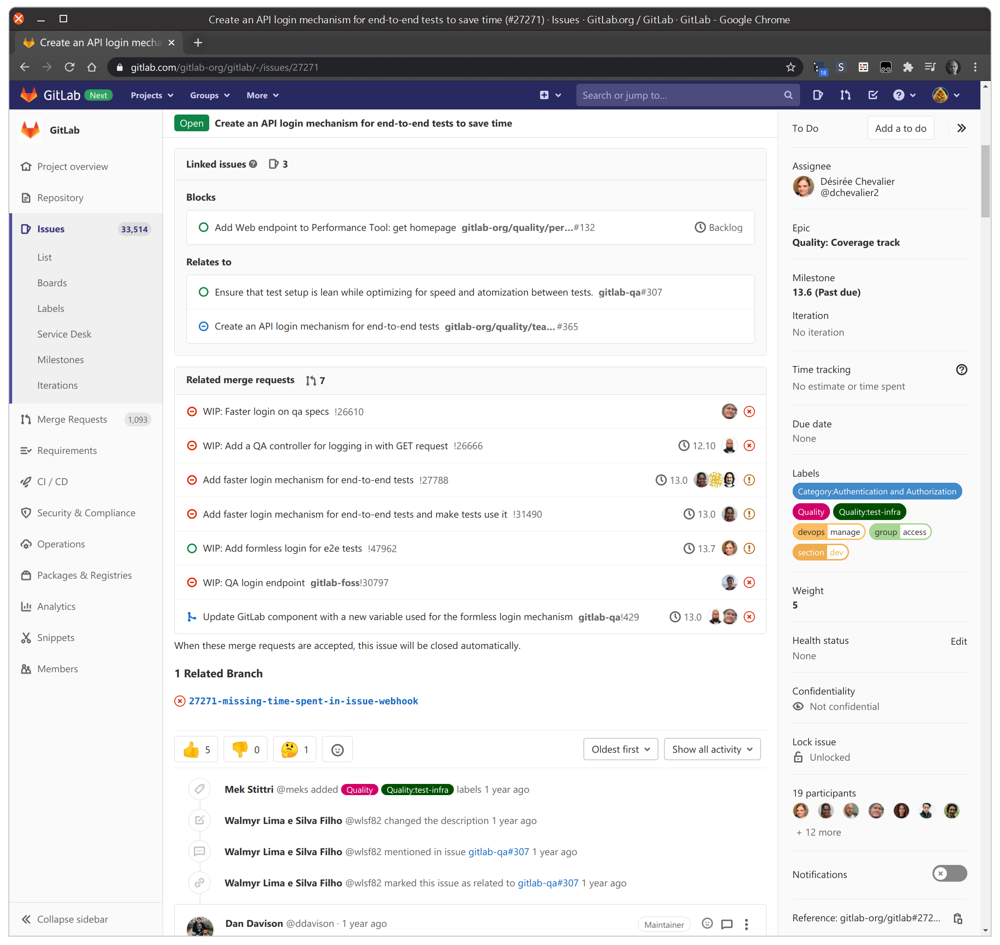
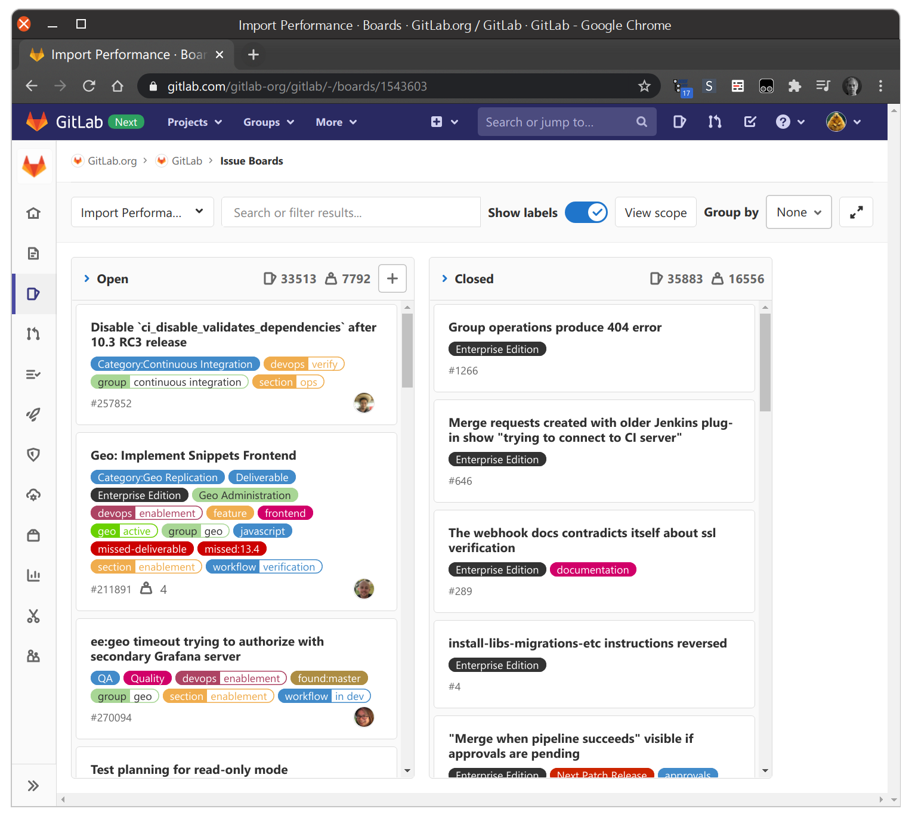

# Userscripts

To be able to install any [userscript](https://en.wikipedia.org/wiki/Userscript), you have to install the [Tampermonkey](https://www.tampermonkey.net/) or [Greasemonkey (Firefox-only)](https://www.greasespot.net/) browser extension.

To install a userscript from this repository, open the respective `*.user.js` file in GitHub and click on the `Raw` button (on the right, above the source code). This will redirect you to the Tampermonkey extension where you can review and install the userscript.

## Overview

### [GitLab focus](gitlab-focus.user.js)

Increase GitLab productivity.

New elements:
- labels for issues in related issues lists
- total weight with progress bar in epic views

Reformat elements:
- board cards (downsize and rearrange elements inside a card)

Highlight elements:
- related lists (add light yellow/orange background to open issues/MRs and downsize closed issues/MRs)

Dim elements:
- timeline items (downsize non-comments)
- placeholders (change font color to light gray)

Screenshots - Issue

Screenshots - Board

